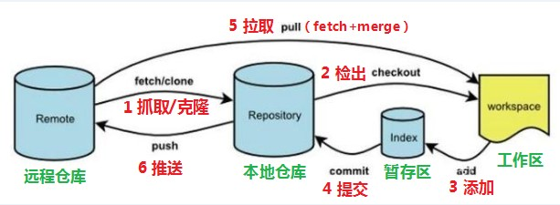
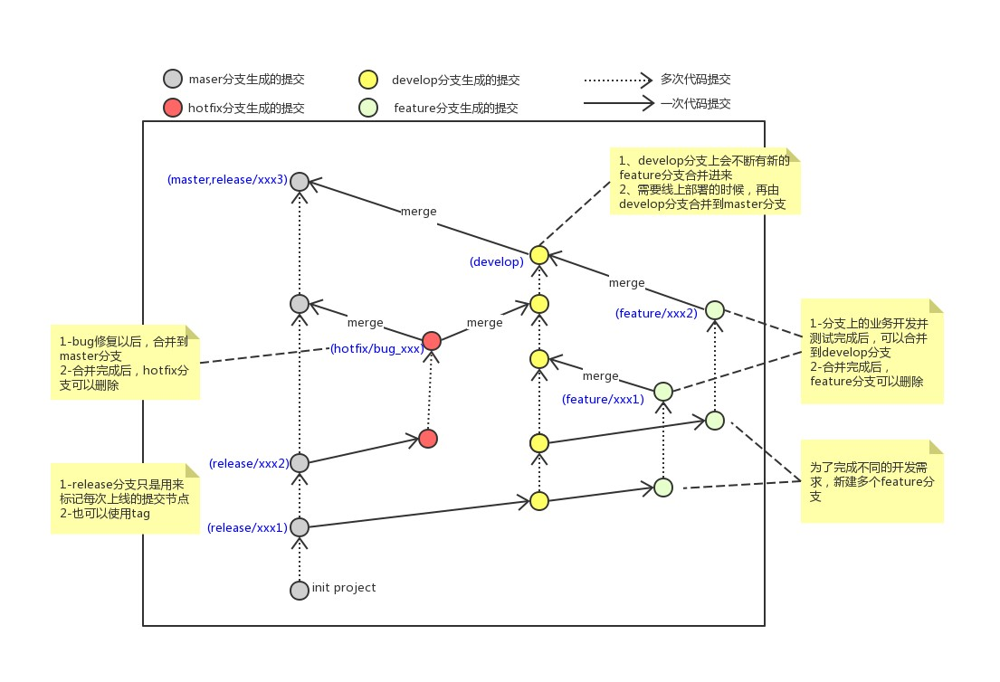

# 第一天学习报告

## 1. Git工作流程

1. clone : 从远程仓库克隆代码到本地
2. checkout : 从本地仓库中检出一个仓库分支然后进行修订
3. add :  在提交前先将代码提交到暂存区
4. commit :  提交到本地仓库。本地仓库中保存修改的各个历史版本
5. fetch : 从远程库，抓取到本地仓库，不进行任何的合并动作，一般操作比较少。
6. pull : 从远程库拉到本地库，自动进行合并(merge)，然后放到到工作区，相当于fetch+merge
7. push :  修改完成后，需要和团队成员共享代码时，将代码推送到远程仓库

## 2. Git命令

- **`ls/ll `**：查看当前目录(ll包含隐藏文件)

- **`cat`** : 查看文件内容

- **`touch`**: 创建文件

- **` vi`**:  vi编辑器

### 2.1 基础操作指令

**1. git add** : 	   工作区 --> 暂存区 

   - ==git add .== : 提交所有文件

   - git add \<filename> :  提交指定文件

**2. git commit** : 暂存区 --> 本地仓库

   - git commit -m "Notes" : Notes 填写提交大致内容
     - fix(作用域) : 修改bug
     - feat : 添加新功能
     - refactor : 重构，不添加修改功能

**3.  git log**  : 查看提交日志
**4.  git status** : 查看修改状态

5. git reset --hard commitID : 回退

### 2.2 分支

**1. **指令

   - git branch : 查看分支

   - git branch \<name> : 创建分支

   - git checkout \<name>: 切换分支

   - ==git checkout -b \<name>== : 创建并切换分支

   - ==git merge \<name>== : 将分支合并到main分支

   - git branch -d \<name>: 合并后删除分支(未合并用-D)

**2. **分支种类

- main分支(master分支)：用于生产发布
- develop分支：开发
- feature/xxxx分支：devlop分支创建，分支上研发成功合并入develop分支
- hotfix分支：修改好bug的分支，合并入main与develop分支

## 3.远程仓库

**1. **生成ssh公钥 

- ssh-keygen -t rsa
- 不断回车，公钥存在则会覆盖

**2. ** 查看公钥 : cat ~/.ssh/id_rsa.pub

git remote add \<name(一般使用origin)> \<远程仓库ssh地址>

