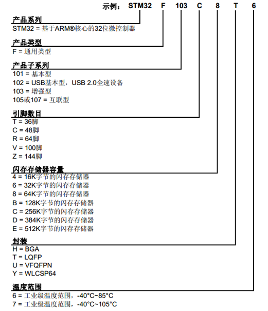
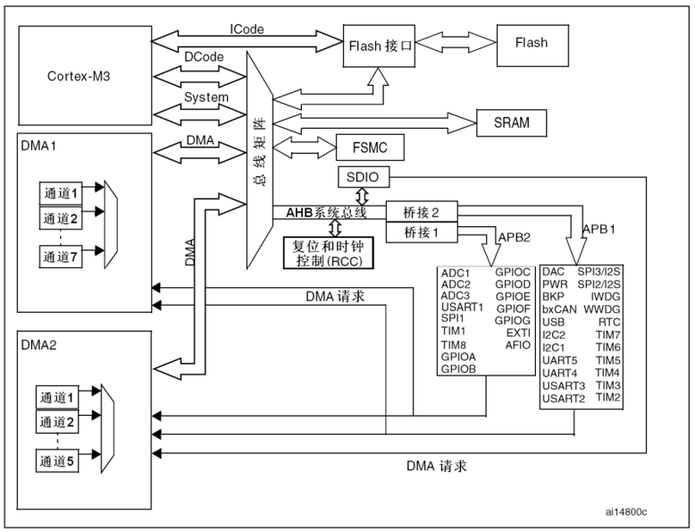
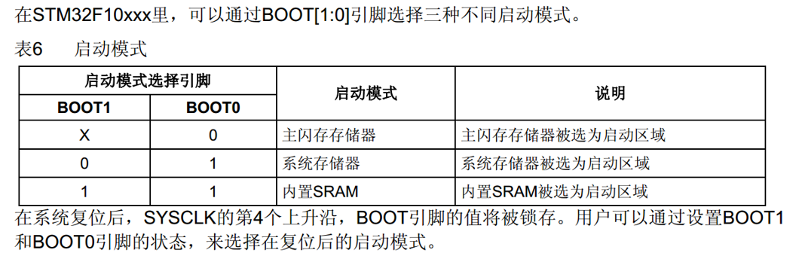
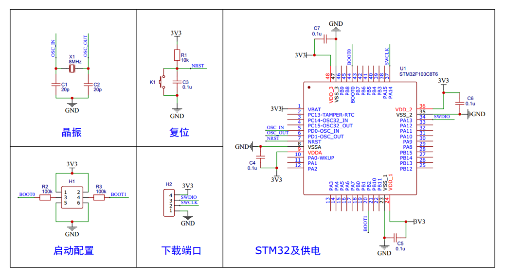

# 第一天学习报告

## 1. Git工作流程

1. clone : 从远程仓库克隆代码到本地
2. checkout : 从本地仓库中检出一个仓库分支然后进行修订
3. add :  在提交前先将代码提交到暂存区
4. commit :  提交到本地仓库。本地仓库中保存修改的各个历史版本
5. fetch : 从远程库，抓取到本地仓库，不进行任何的合并动作，一般操作比较少。
6. pull : 从远程库拉到本地库，自动进行合并(merge)，然后放到到工作区，相当于fetch+merge
7. push :  修改完成后，需要和团队成员共享代码时，将代码推送到远程仓库

## 2. Git命令

- **`ls/ll `**：查看当前目录(ll包含隐藏文件)

- **`cat`** : 查看文件内容

- **`touch`**: 创建文件

- **` vi`**:  vi编辑器

### 2.1 基础操作指令

#### **1. git add** : 	   工作区 --> 暂存区 

   - ==git add .== : 提交所有文件

   - git add \<filename> :  提交指定文件

#### **2. git commit** : 暂存区 --> 本地仓库

   - git commit -m "Notes" : Notes 填写提交大致内容
     - fix(作用域) : 修改bug
     - feat : 添加新功能
     - refactor : 重构，不添加修改功能

#### **3.  git log**  : 查看提交日志
#### **4.  git status** : 查看修改状态

#### 5. git reset --hard commitID : 回退

### 2.2 分支

#### **1. **指令

   - git branch : 查看分支

   - git branch \<name> : 创建分支

   - git checkout \<name>: 切换分支

   - ==git checkout -b \<name>== : 创建并切换分支

   - ==git merge \<name>== : 将分支合并到main分支

   - git branch -d \<name>: 合并后删除分支(未合并用-D)

#### **2. **分支种类

- main分支(master分支)：用于生产发布
- develop分支：开发
- feature/xxxx分支：devlop分支创建，分支上研发成功合并入develop分支
- hotfix分支：修改好bug的分支，合并入main与develop分支

## 3.远程仓库

### **1. **生成ssh公钥

- ssh-keygen -t rsa
- 不断回车，公钥存在则会覆盖

### **2. ** 查看公钥 : cat ~/.ssh/id_rsa.pub

### **3. **操作远程仓库

- git remote add \<name(一般使用origin)> \<远程仓库ssh地址> ： 添加远程仓库
- git remote : 查看远程仓库

### **4. ** 推送至仓库

- ==git push== [-f] [--set-upstream] [远端名称[本地分支名]\[:远端分支名] ]
  - git push --set-upstream origin main 后续只需git push
  - 或每一次上传使用 git push origin main

### **5. ** 克隆

- git clone \<仓库路径> [本地目录]

### **6. ** 抓取和拉取

- git fetch [remote name] [branch name]: 将仓库的更新抓取到本地，不进行合并
- ==git pull==[remote name] [branch name]: 抓取并合并

###  **7. ** 合并冲突

- 先pull再push

---

## stm

**1. ** 片上资源

| 英文缩写 | 名称 | 英文缩写 | 名称 |
| :--------: | :----: | :--------:| :----: |
| NVIC | 嵌套向量中断控制器 | CAN | CAN通信 |
| SysTick | 系统滴答计时器 | USB | USB通信 |
| RCC | 复位和时钟控制 | RTC | 实时时钟 |
| GPIO | 通用IO口 | CRC | CRC校验 |
| AFIO | 复用IO口 | ==PWR== | 电源控制 |
| EXTI | 外部中断 | BKP | 备份寄存器 |
| TIM | 定时器 | IWDG | 独立看门狗 |
| ADC | 模数转换器 | WWDG | 窗口看门狗 |
| DMA | 直接内存访问 | DAC | 数模转换器 |
| ==USART== | 同步/异步串口通信 | SDIO | SD卡接口 |
| I2C | I2C通信 | FSMC | 可变静态存储控制器 |
| SPI | SPI通信 | USB OTG | USB主接口 |

**2. ** 命名规则

**3. ** 系统结构

**4. **引脚定义

- 类型
  - s：电源
  - i：输入
  - o：输出
  - i/o：输入/输出
- 电平
  - FT：能容忍5V电压
  - 无：能容忍3.3V电压

- 引脚
  - 1号引脚：==备用电源==。系统电源断电时，为RTC时钟与备份寄存器供电
  - 2号引脚：IO口/侵入检测/RTC(输入输出高低电平/安全保障/输出RTC校准时钟)
  - 3、4号引脚：IO口/接32.768Hz的RTC晶振
  - 5、6号引脚：接主晶振，通常8MHz
  - 7号引脚：系统复位引脚，N表示低电平复位
  - 8、9号引脚：内部模拟部分的电源，VSS是负极，接GND，VDD是正极，接3.3V
  - 10~19、21、22号引脚：IO口，10号引脚WKUP还可用于唤醒待机模式的STM32
  - 20号引脚：IO口/BOOT，BOOT引脚负责配置启动模式
  - 23、24、35、36、47、48号引脚：==主电源口==，VSS是负极，接GND，VDD是正极，接3.3V

