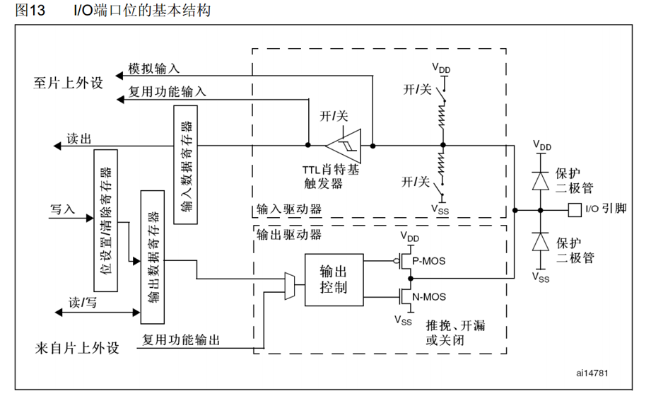
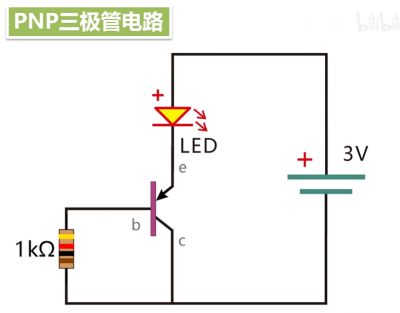
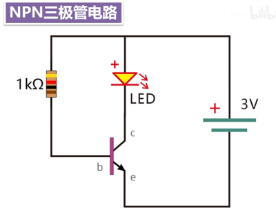
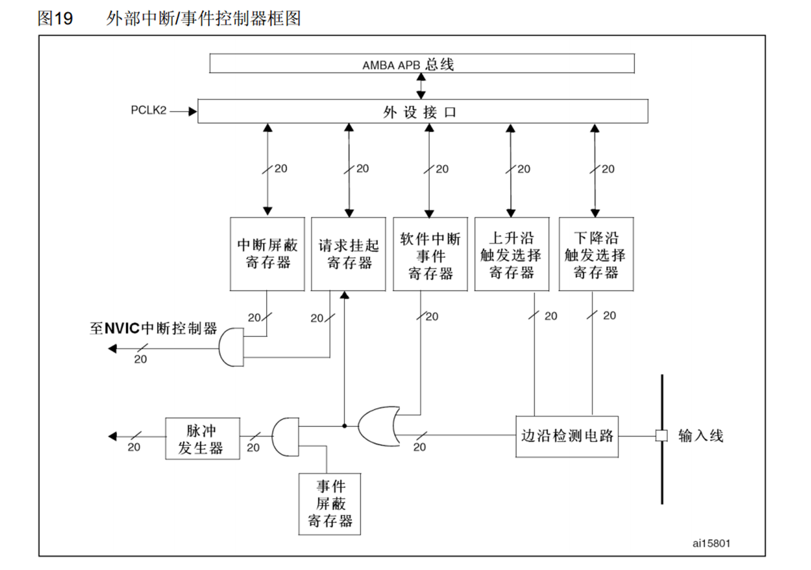
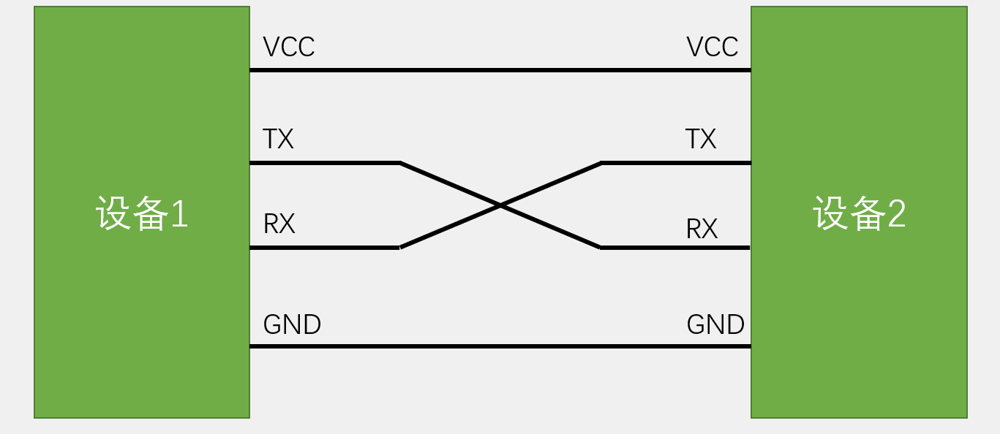
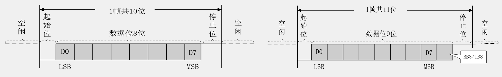

# 第二天学习笔记

---

## GPIO(通用输入输出模块)

##### - 电平：0~3.3V，部分引脚可容忍5V

##### -8种模式

|   模式名称   |   性质   |                             特征                             |
| :----------: | :------: | :----------------------------------------------------------: |
|   浮空输入   | 数字输入 |           可读取引脚电平，若引脚悬空，则电平不确定           |
|   上拉输入   | 数字输入 |      可读取引脚电平，内部链接上拉电阻，悬空时默认高电平      |
|   下拉输入   | 数字输入 |      可读取引脚电平，内部链接下拉电阻，悬空时默认低电平      |
|   模拟输入   | 模拟输入 |              ==GPIO无效==，引脚直接接入内部ADC               |
|   开漏输出   | 数字输出 | 可输出引脚电平，高电平为高阻态(高电平==无驱动能力==，低电平有驱动能力，特殊情况使用) |
|   推挽输出   | 数字输出 | 可输出引脚电平，高电平接VDD(高低电平==均有驱动能力==，一般情况使用) |
| 复用开漏输出 | 数字输出 |                有片上外设控制，高电平为高阻态                |
| 复用推挽输出 | 数字输出 |                 有片上外设控制，高电平接VDD                  |

---

## 中断

- 程序运行过程中触发中断条件，停止当前程序，去处理中断程序。（中断可嵌套，高优先级程序可中断低优先级）
- NVIC的中断优先级由优先级寄存器==4位==（0~15）决定，这4位可分为高n为的==抢占优先级==和低4-n位的==响应优先级==，抢占优先级告的可以中断嵌套，响应优先级高的可以优先排队，均相同按终端号排队

### EXTI外部中断

- 监测指定GPIO口电平信号，产生电平变化时，EXTI发出中断申请，NVIC裁决后中断CPU主程序，执行中断程序。
- 触发方式：上升沿/ 下降沿/ 双边沿/ 软件触发
- 支持GPIO口，所有GPIO口，但是相同的Pin不能同时出发中断
- 触发响应方式：中断响应/  事件响应(事件相应不触发中断，触发其他外设操作)

---

## USART串口

### 通信目的：将一个设备的数据传送到另一个设备，拓展硬件功能。

###  通信协议，双方按照协议规则进行数据收发

| 名称  |                             引脚                             |  双工  | 时钟 | 电平 |  设备  |
| :---: | :----------------------------------------------------------: | :----: | :--: | :--: | :----: |
| USART |              TX（数据发送脚）、RX（数据接收脚）              | 全双工 | 异步 | 单端 | 点对点 |
|  I2C  |                   SCL（时钟）、SDA（数据）                   | 半双工 | 同步 | 单端 | 多设备 |
|  SPI  | SCLK（时钟）、CS（片选） MISO（主机输入数据脚）、MOSI（主机输出数据脚） | 全双工 | 同步 | 单端 | 多设备 |
|  CAN  |                CAN_H、CAN_L（一对差分数据脚）                | 半双工 | 异步 | 差分 | 多设备 |
|  USB  |                   DP、DM（一对差分数据脚）                   | 半双工 | 异步 | 差分 | 点对点 |

- 全双工：含两根通讯线，支持==双向同时通讯==

- 半双工：一次只能一个方向通讯（单工：数据只能从一个设备向另一个设备）

- 同步：有单独时钟线，接收方在时钟信号指引下接收信号

- 异步：双方==约定采样频率==，还需==添加帧头帧尾==进行采样位置对其

- 单端电平：高低电平取决于对GND的电压差，通信==双方==需要==共地==

- 差分电平：通过差分引脚电压差传输信号，通讯时不需要GND（USB协议在其他特殊情况需要GND），差分信号可提高抗干扰能力，传输速度快，距离远

- 多设备：需要有寻址过程，确定通讯对象

###  硬件电路

- 简单双向串口通信有两根通信线（发送端TX和接收端RX）
- TX和RX要交叉连接
- 当只需单向的数据传输时，可以只接一根通讯线
- 电平标准不一致时，需要加电平转换芯片
- ==TX、RX、GND必须连接==，若一个设备无独立供电，则需要将两个设备VCC相连，由另一个设备供电。

### 电平标准

- ==TTL电平==： 3.3V或5V表示1，0V表示0
- RS232电平：-3\~-15V表示1，3~15V表示0（用于大型机器，环境恶劣，静电干扰大）
- RS485电平：两线压差2\~6V表示1，-2~-6V表示0（差分信号,传输距离远）

### 串口参数

- 波特率：串口通信的速率（每秒传输码元的个数）
- 起始位：标志一个数据帧的开始，==固定为低电平==（空闲状态数据为高电平，起始位用于区分数据）
- 数据位：数据帧的有效载荷，1为高电平，0为低电平，低位先行
- 校验位：用于数据验证，（奇校验：根据前八个数据为中1的个数，若前八个数据位有偶数个1，校验位为1，反之为0，偶校验同理），接收方根据数据位中1的数量与校验方式是否匹配判断当前数据是否出错
- 停止位：用于数据帧间隔，固定为高电平

